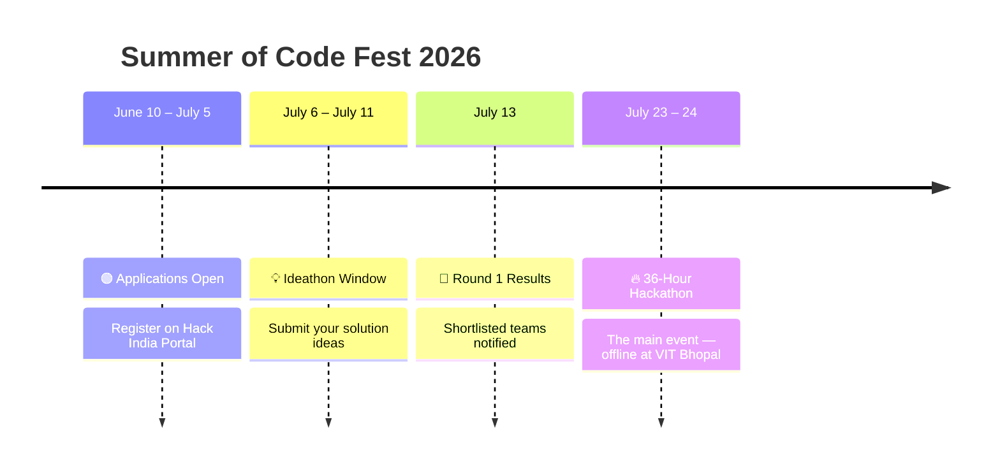

<div align="center">


<br><br>


<br><br>

<a href="https://hackindia.xyz">

</a>

<a href="#">

</a>

<a href="#">

</a>

<br><br>


</div>
---

## ✦ What is Summer of Code Fest?


**Summer of Code Fest** is the **flagship innovation hackathon** by the GSoC Innovators' Club at VIT Bhopal University — a 36-hour all-nighter where students across every discipline come together to build, break, and ship.

It is a **two-stage battle of brains:**

```
┌─────────────────────────────────────────────────────────────────┐
│  🧠  ROUND 1 — IDEATHON  (Online · Free for All)               │
│      Pitch your solution. Qualify for the main stage.           │
├─────────────────────────────────────────────────────────────────┤
│  ⚡  ROUND 2 — HACKATHON  (Offline · 36 Hrs · VIT Bhopal)      │
│      Build an end-to-end MVP. Present. Win.                     │
└─────────────────────────────────────────────────────────────────┘
```

<br/>

---

## ⏳ Event Timeline



<br/>

---

## 🗓️ 36-Hour Schedule — Round 2

<div align="center">

| 🕐 Time | 🎯 Phase | 📋 Details |
|:---:|:---:|:---|
| **Day 1 · 09:00** | 🎤 Opening Ceremony | Welcome, rules briefing, theme reveal & mentor intros |
| **Day 1 · 10:00** | 💻 Hacking Begins | Teams set up, finalise idea, and start building |
| **Day 1 · 14:00** | 🧩 Mini-Challenge #1 | **DSA Problem Set** — bonus points up for grabs |
| **Day 1 · 20:00** | 👀 Midpoint Check-in | Organisers do an informal walkthrough of all teams |
| **Day 1 · 22:00** | 🐛 Mini-Challenge #2 | **Bug Bounty** — hunt and document planted bugs |
| **Day 2 · 06:00** | ⚡ Mini-Challenge #3 | **Tech Quiz** — rapid-fire trivia round |
| **Day 2 · 12:00** | 🔒 Code Freeze | Final submissions pushed to GitHub |
| **Day 2 · 13:00** | 🎯 Demo Day | 5-min pitch + Q&A with judges |
| **Day 3 · 09:00** | 🏆 Evaluations Begin | Projects scored; winners determined |
| **Day 3 · 16:00** | 🎉 Closing Ceremony | Prizes, networking, and closing remarks |

</div>

<br/>

---

## 🎯 Competition Themes

<div align="center">

```
╔══════════════════════════════════════════════════════════════════════╗
║                     CHOOSE YOUR BATTLEFIELD                          ║
╚══════════════════════════════════════════════════════════════════════╝
```

</div>

<table>
<tr>
<td width="50%">

### ⚙️ Hardware Project
> *Embedded Systems · IoT · Robotics · Physical Computing*

Build a **physical prototype** that integrates hardware and software. Think:
- 🔌 IoT devices & sensor networks
- 🦾 Robotics & embedded control
- ⌚ Wearable tech & smart automation

**A working physical unit is required at Demo Day.**

</td>
<td width="50%">

### 🤖 AI Agent
> *Machine Learning · LLMs · Autonomous Systems · NLP*

Deploy an **intelligent agent** that reasons, plans, or decides. Think:
- 🧠 LLM-powered productivity tools
- 📚 Education & accessibility agents
- 🔬 Research & data assistants

**Autonomous reasoning must be demonstrable.**

</td>
</tr>
<tr>
<td width="50%">

### 🏫 Campus Problem Solver
> *EdTech · Campus Infra · Student Life · Admin Automation*

Fix a **real pain point at VIT Bhopal**. Think:
- 📅 Academic scheduling tools
- 🍽️ Canteen queue busters
- 🏠 Hostel & resource management

**The more measurable the impact, the better.**

</td>
<td width="50%">

### 💡 Open Innovation
> *No Restrictions · Any Domain · Cross-disciplinary*

Absolutely **no constraints**. Think:
- 💸 Fintech & Healthtech
- 🌱 Sustainability solutions
- 🛠️ Developer tools & games

**If it solves a real problem beautifully — it qualifies.**

</td>
</tr>
<tr>
<td colspan="2" align="center">

### 😂 Make a Solution from a Meme
> *No Restrictions · Any Domain · Guaranteed Chaos*

Connect the spirit of a **meme** to an actual working solution. No domain constraints — no seriousness required. If it makes people giggle **and** actually works, it's through.

</td>
</tr>
</table>

<br/>

---

## ⚡ Mid-Event Mini-Challenges

> Optional. High-risk, high-reward. Mini-challenges account for **10–20% of your total score.**

<div align="center">

| ⚡ Challenge | 📖 Description | 🏅 Bonus |
|:---:|:---|:---:|
| 🧩 **DSA Problem Set** | 1–3 algorithmic problems of varying difficulty. Fastest correct submission wins. | **+10 pts** |
| 🐛 **Bug Bounty** | Hunt bugs in curated code snippets. Partial credit for partial fixes. | **+5 pts** |
| 🧠 **Tech Quiz** | Rapid-fire CS trivia — fundamentals, GSoC culture, VIT knowledge. | **+5 pts** |
| 🎨 **Design Blitz** | A UI mockup or system design diagram in 45 minutes flat. | **+10 pts** |
| 🌐 **Open-Source Trivia** | Famous OSS projects, contributors, and GitHub culture. | **+5 pts** |

</div>

### 🎁 Challenge Rewards Include:
```
👕 GSoC Innovators' Club Branded Merch (T-shirts · Stickers · Hoodies)
🖥️ Tech Accessories (USB Hubs · Cable Kits · Notebook Sets)
🍔 Snack Vouchers & Café Credits Redeemable On Campus
📜 Certificate of Excellence for Challenge Winners
🎟️ Wildcard Entry to Club Workshops & Masterclasses
```

<br/>

---

## 🏆 Judging Criteria

<div align="center">

```
  INNOVATION & CREATIVITY      ██████████████████████████   25%
  TECHNICAL IMPLEMENTATION     ██████████████████████████   25%
  IMPACT & PROBLEM FIT         ████████████████████         20%
  PRESENTATION & PITCH         ███████████████              15%
  MINI-CHALLENGE BONUS         ███████████████              15%
```

*Judged by faculty mentors, industry guests & senior club alumni*

</div>

<br/>

| Criterion | Weight | What Judges Look For |
|---|:---:|---|
| 🌟 Innovation & Creativity | **25%** | Novelty of idea; originality of approach; creative use of technology |
| ⚙️ Technical Implementation | **25%** | Code quality, architecture, completeness, and working demo |
| 🎯 Impact & Problem Fit | **20%** | Real-world applicability; how well it solves the stated problem |
| 🎤 Presentation & Pitch | **15%** | Clarity of explanation; demo quality; ability to handle Q&A |
| ⚡ Mini-Challenge Bonus | **15%** | Aggregate bonus points earned across all mid-event challenges |

<br/>

---

## 🥇 Prizes & Recognition

<div align="center">

```
┌──────────────────────────────────────────────────────────────────────┐
│                                                                      │
│   🥇  1st Place   →  Trophy + Cash Prize + Certificates + Merch     │
│   🥈  2nd Place   →  Certificate of Excellence + Merchandise        │
│   🥉  3rd Place   →  Certificate of Merit + Merchandise             │
│                                                                      │
│   🏅  Track Winners  →  Individual prizes per theme                 │
│   ⚡  Challenge Champions  →  Spot goodies + Social shoutout        │
│   🎖️  Leaderboard Topper  →  Special prize at closing ceremony      │
│   🎉  All Participants  →  Goodies as per eligibility               │
│                                                                      │
└──────────────────────────────────────────────────────────────────────┘
```

</div>

<br/>

---

## 📋 Rules & Participation

### 👥 Team Structure
```
Solo  ·  Duo  ·  Team (4–5 members)
Cross-department & cross-year teams strongly encouraged.
Each team must have a designated Team Lead.
```

### ✅ Eligibility
- Any student **currently enrolled** at a registered institution
- Alumni and faculty may join as **mentors only**
- Each participant may only be part of **one team**

### 💰 Registration Fee (Round 2 Only)
| Participant | Fee |
|---|:---:|
| 🎓 VIT Bhopal students | ₹ 99 |
| 🏫 Students from other institutions | ₹ 49 |

> *Participants outside VIT Bhopal manage their own travel & stay.*

### 📦 Submission Requirements
- ✅ Source code on **GitHub before Code Freeze**
- ✅ Project description — **max 300 words**
- ✅ Demo video — **max 3 minutes** (or live demo at Demo Day)
- ✅ Document all external APIs, libraries & datasets used
- ✅ GitHub repo must include tags: `GSOC-Innovators-Club` · `Summer-of-CodeFest-26`

### 🚫 Code of Conduct
- All work must be **original and built during the event window**
- Open-source libraries, APIs, and public datasets are permitted
- Pre-built projects → **immediate disqualification**
- Plagiarism / academic dishonesty → **immediate disqualification**
- Respect for all participants, judges & organisers is non-negotiable

<br/>

---

## 🚀 How to Register

```
Step 1  →  Head to Hack India portal
Step 2  →  Apply between June 10 – July 5
Step 3  →  Submit your idea (July 6 – July 11)
Step 4  →  Check results on July 13
Step 5  →  Pay fee · Show up · BUILD SOMETHING LEGENDARY
```

<div align="center">

[](https://hackindia.xyz)

</div>

<br/>

---

## 🌐 Connect With Us

<div align="center">

[](https://instagram.com)
[](https://linkedin.com)
[](https://github.com)

</div>

<br/>

---

<div align="center">

*Made with ❤️ by the GSoC Innovators' Club — VIT Bhopal University*


</div>
