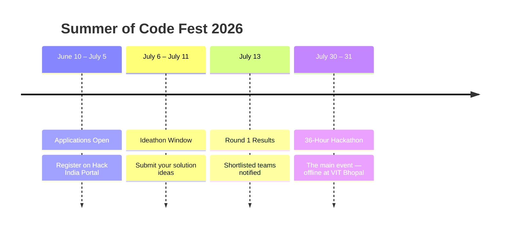

<div align="center">


<br/>

<p></p>


</div>

<br/>

---

## ✦ What is Summer of Code Fest?

**Summer of Code Fest** is the **flagship innovation hackathon** by the GSoC Innovators' Club at VIT Bhopal University — a 36-hour all-nighter where students across every discipline come together to build, break, and ship.

It is a **two-stage battle of brains**, taking participants from an idea on paper to a working product on stage.

<div align="center">

<table>
<tr>
<td width="50%" valign="top">

<div align="center">

### Round 1 — Ideathon


Pitch your solution idea through the Hack India portal.
The strongest ideas get shortlisted to qualify for the main stage at VIT Bhopal.

**Outcome →** Shortlist for Round 2

</div>

</td>
<td width="50%" valign="top">

<div align="center">

### Round 2 — Hackathon


Build a complete, working MVP from scratch at VIT Bhopal University.
Present it live to judges and compete for the top spots.

**Outcome →** Winners & Prizes

</div>

</td>
</tr>
</table>

</div>

<br/>

---
## Event Timeline



<br/>

## 36-Hour Schedule — Round 2

<div align="center">

| Day | Time | Phase | Details |
|:---:|:---:|:---|:---|
| Day 1 | 09:00 | Opening Ceremony | Welcome, rules briefing, theme reveal & mentor intros |
| Day 1 | 10:00 | Hacking Begins | Teams set up, finalise idea, and start building |
| Day 1 | 14:00 | Mini-Challenge 1 — DSA Problem Set | Bonus points up for grabs |
| Day 1 | 20:00 | Midpoint Check-in | Organisers do an informal walkthrough of all teams |
| Day 1 | 22:00 | Mini-Challenge 2 — Bug Bounty | Hunt and document planted bugs |
| Day 2 | 06:00 | Mini-Challenge 3 — Tech Quiz | Rapid-fire trivia round |
| Day 2 | 12:00 | Code Freeze | Final submissions pushed to GitHub |
| Day 2 | 13:00 | Demo Day | 5-minute pitch + Q&A with judges |
| Day 3 | 09:00 | Evaluations Begin | Projects scored; winners determined |
| Day 3 | 16:00 | Closing Ceremony | Prizes, networking, and closing remarks |

</div>

<br/>

---

## Competition Themes

<div align="center">

```
                        ╔══════════════════════════════════════════════════════════════════════╗
                        ║                     CHOOSE YOUR BATTLEFIELD                          ║
                        ╚══════════════════════════════════════════════════════════════════════╝
```

<table>
<tr>
<td width="50%" valign="top">

## Hardware Project


Build a **physical prototype** that integrates hardware and software.

-  IoT devices & sensor networks
-  Robotics & embedded control
-  Wearable tech & smart automation

> A working physical unit is required at Demo Day.

</td>
<td width="50%" valign="top">

## AI Agent


Deploy an **intelligent agent** that reasons, plans, or decides.

-  LLM-powered productivity tools
-  Education & accessibility agents
-  Research & data assistants

> Autonomous reasoning must be demonstrable.

</td>
</tr>
<tr>
<td width="50%" valign="top">

## Campus Problem Solver


Fix a **real pain point at VIT Bhopal**.

-  Academic scheduling tools
-  Canteen queue busters
-  Hostel & resource management

> The more measurable the impact, the better.

</td>
<td width="50%" valign="top">

## Open Innovation


Absolutely **no constraints** — any domain qualifies.

-  Fintech & Healthtech
-  Sustainability solutions
-  Developer tools & games

> If it solves a real problem beautifully — it qualifies.

</td>
</tr>
<tr>
<td colspan="2" align="center">

### 😂 Make a Solution from a Meme


Connect the spirit of a **meme** to an actual working solution.
No domain constraints, no seriousness required.

> If it makes people giggle **and** actually works, it's through.

</td>
</tr>
</table>

</div>

<br/>

---

## Mid-Event Mini-Challenges

> Optional. High-risk, high-reward. Mini-challenges account for **10–20% of your total score.**

<div align="center">

| Challenge | Description | Bonus |
|:---:|:---|:---:|
|  **DSA Problem Set** | 1–3 algorithmic problems of varying difficulty. Fastest correct submission wins. | **+10 pts** |
|  **Bug Bounty** | Hunt bugs in curated code snippets. Partial credit for partial fixes. | **+5 pts** |
|  **Tech Quiz** | Rapid-fire CS trivia — fundamentals, GSoC culture, VIT knowledge. | **+5 pts** |
|  **Design Blitz** | A UI mockup or system design diagram in 45 minutes flat. | **+10 pts** |
|  **Open-Source Trivia** | Famous OSS projects, contributors, and GitHub culture. | **+5 pts** |

</div>

### 🎁 Challenge Rewards Include:
```
 - GSoC Innovators' Club Branded Merch (T-shirts · Stickers · Hoodies)
 - Tech Accessories (USB Hubs · Cable Kits · Notebook Sets)
 - Snack Vouchers & Café Credits Redeemable On Campus
 - Certificate of Excellence for Challenge Winners
 - Wildcard Entry to Club Workshops & Masterclasses
```

<br/>

---

## Judging Criteria

<div align="center">


*Judged by faculty mentors, industry guests & senior club alumni*

</div>

<br/>

| Criterion | Weight | What Judges Look For |
|---|:---:|---|
|  Innovation & Creativity | **25%** | Novelty of idea; originality of approach; creative use of technology |
|  Technical Implementation | **25%** | Code quality, architecture, completeness, and working demo |
|  Impact & Problem Fit | **20%** | Real-world applicability; how well it solves the stated problem |
|  Presentation & Pitch | **15%** | Clarity of explanation; demo quality; ability to handle Q&A |
|  Mini-Challenge Bonus | **15%** | Aggregate bonus points earned across all mid-event challenges |

<br/>

---

## Prizes & Recognition

<div align="center">

<table>
<tr>
<td align="center" width="33%">

### 🥇 1st Place


Cash Prize + Certificates + Exclusive Merch

</td>
<td align="center" width="33%">

### 🥈 2nd Place


Certificate of Excellence + Merchandise

</td>
<td align="center" width="33%">

### 🥉 3rd Place


Certificate of Merit + Merchandise

</td>
</tr>
</table>

<br/>

| 🎖️ Special Recognition | What You Get |
|:---|:---|
|  **Track Winners** | Individual prizes per theme |
|  **Challenge Champions** | Spot goodies + social shoutout |
|  **Leaderboard Topper** | Special prize at closing ceremony |
|  **All Participants** | Goodies as per eligibility |

</div>

<br/>

---

## Rules & Participation

### 👥 Team Structure
```
Solo  ·  Duo  ·  Team (4–5 members)
Cross-department & cross-year teams strongly encouraged.
Each team must have a designated Team Lead.
```

### ✅ Eligibility
- Any student **currently enrolled** at a registered institution
- Alumni and faculty may join as **mentors only**
- Each participant may only be part of **one team**

### 💰 Registration Fee (Round 2 Only)
| Participant | Fee |
|---|:---:|
| 🎓 VIT Bhopal students | ₹ 99 |
| 🏫 Students from other institutions | ₹ 49 |

> *Participants outside VIT Bhopal manage their own travel & stay.*

### 📦 Submission Requirements
-  Source code on **GitHub before Code Freeze**
-  Project description — **max 300 words**
-  Demo video — **max 3 minutes** (or live demo at Demo Day)
-  Document all external APIs, libraries & datasets used
-  GitHub repo must include tags: `GSOC-Innovators-Club` · `Summer-of-CodeFest-26`

### 🚫 Code of Conduct
- All work must be **original and built during the event window**
- Open-source libraries, APIs, and public datasets are permitted
- Pre-built projects → **immediate disqualification**
- Plagiarism / academic dishonesty → **immediate disqualification**
- Respect for all participants, judges & organisers is non-negotiable

<br/>

---

## How to Register

```
Step 1  →  Head to Hack India portal
Step 2  →  Apply between June 10 – July 5
Step 3  →  Submit your idea (July 6 – July 11)
Step 4  →  Check results on July 13
Step 5  →  Pay fee · Show up · BUILD SOMETHING LEGENDARY
```

<div align="center">

[](https://hackindia.xyz)

</div>

<br/>

---

## Connect With Us

<div align="center">

[](https://instagram.com)
[](https://linkedin.com)
[](https://github.com)

</div>

<br/>

---

<div align="center">

*Made by the GSoC Innovators' Club — VIT Bhopal University*


</div>
